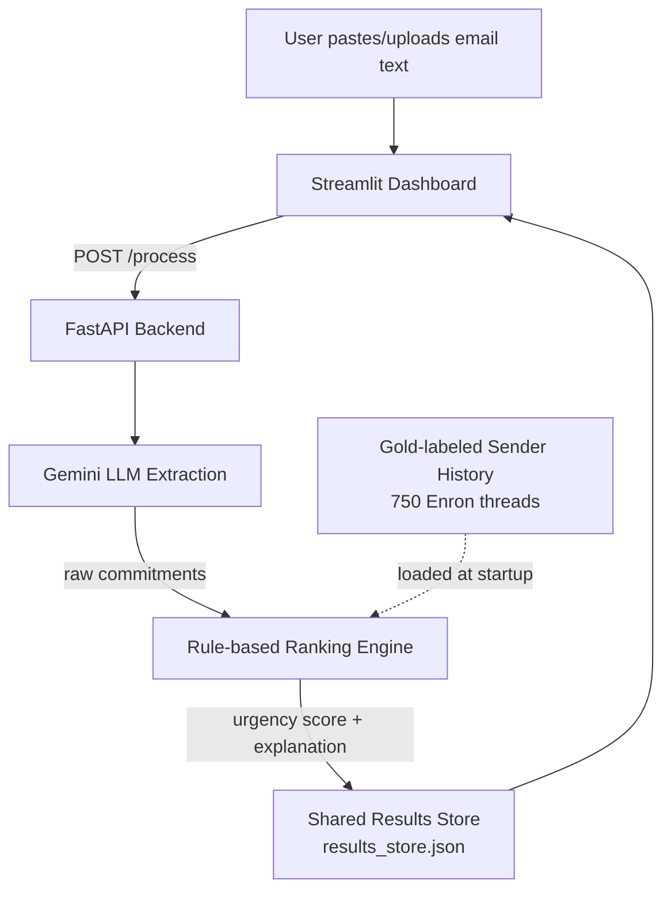

# AI Commitment Intelligence System

Extracts commitments (who promised what, to whom, by when) from email text,
ranks them by urgency, and explains each ranking in plain language — so a
professional never loses track of what they owe or are owed.

**🔗 Live demo:** https://ai-commitment-intelligence.onrender.com/
*(Free-tier hosting: the app sleeps after inactivity — first load may take
30-50 seconds to wake up. This is expected, not a bug.)*

---

## What it does

Paste an email or thread into the dashboard, and the system:
1. Extracts every commitment (made or requested), with sender, recipient,
   deadline, and confidence
2. Scores each one 0–100 for urgency, combining deadline urgency, sender
   frequency, and extraction confidence
3. Generates a plain-language explanation for why each item was ranked
   where it was

## Architecture



Both the API and the dashboard run inside a single Docker container
(see `start.sh`) — the dashboard reaches the API over `localhost`
internally, and only the dashboard's port is exposed publicly by the host.

## Results (test set, held out, touched once)

| Metric | Score |
|---|---|
| Precision | 0.957 |
| Recall | 0.843 |
| F1 | 0.897 |
| Direction accuracy | 100% |

1,190 gold-labeled commitments, from a 750-thread Enron Email Corpus subset
+ 10 synthetic edge-case threads, 70/15/15 split. Full error analysis: 36
mismatches across 6 categories (see `docs/phase6_evaluation.md`).

## Tech stack

| Layer | Tool |
|---|---|
| Extraction | Gemini free-tier API (`google-genai` SDK), few-shot prompting |
| Ranking | Rule-based multi-factor scorer (`src/rank_score.py`) |
| Backend | FastAPI (`app/main.py`) |
| Frontend | Streamlit (`app/frontend.py`) |
| Deployment | Docker, hosted free on Render |

## Running it locally

```bash
pip install -r requirements.txt

# Terminal 1 - API
export GOOGLE_API_KEY="your-key-here"     # PowerShell: $env:GOOGLE_API_KEY="..."
uvicorn app.main:app --reload --port 8000

# Terminal 2 - Dashboard
streamlit run app/frontend.py
```
Or via Docker:
```bash
docker build -t commitment-intelligence .
docker run -p 7860:7860 -e GOOGLE_API_KEY="your-key-here" commitment-intelligence
```

## Project structure

```
app/
  main.py          # FastAPI: /health, /extract, /process
  frontend.py       # Streamlit dashboard
src/
  gemini_extractor.py    # LLM-based commitment extraction
  rank_features.py       # Feature engineering for ranking
  rank_score.py           # Urgency scoring + explanation generation
data/
  gold_set/v1/            # 1,190 gold-labeled commitments, train/val/test split
docs/                     # Phase-by-phase setup guides and evaluation writeups
Dockerfile, start.sh, requirements.txt   # Deployment
```

## Known limitations (disclosed, not hidden)

- **Sender identification** can resolve to a pronoun (e.g. "I") on
  first-person text with no named signoff.
- **Conditional deadlines** ("if the client signs off today, we need X by
  Friday") extract the deadline but don't yet preserve the condition itself.
- **Free-tier hosting**: cold starts after inactivity, and the results
  store is not guaranteed to persist across a service restart.
- **Automated Gmail ingestion** (Phase 8.5) is an optional, not-yet-built
  checkpoint — the project is fully defensible on the live paste/upload
  demo alone. See `docs/` for the full design if it gets built later.

## Scope note

This is a deliberately narrowed slice of a larger "AI professional memory"
concept — full relationship graphs, opportunity recovery, and cross-platform
memory are explicitly out of scope and documented as future work, not
silently dropped. See the companion scope and roadmap documents for the
full reasoning.
